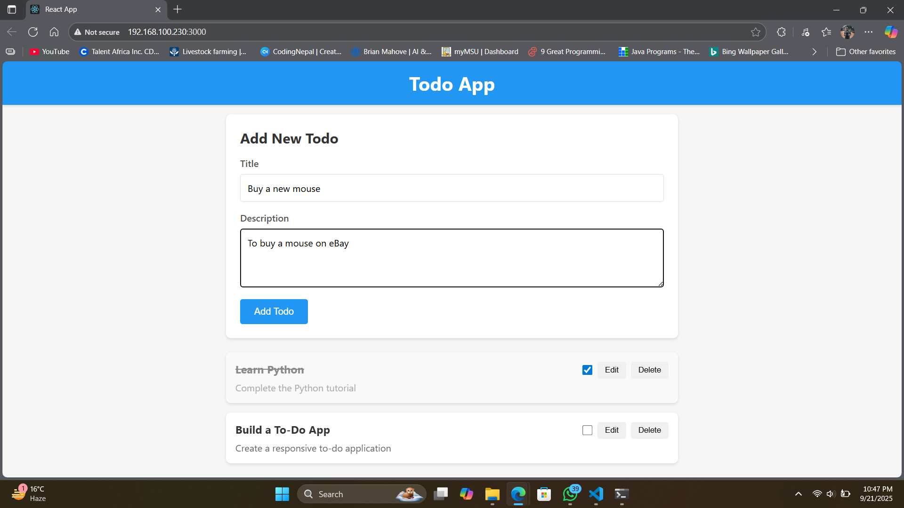
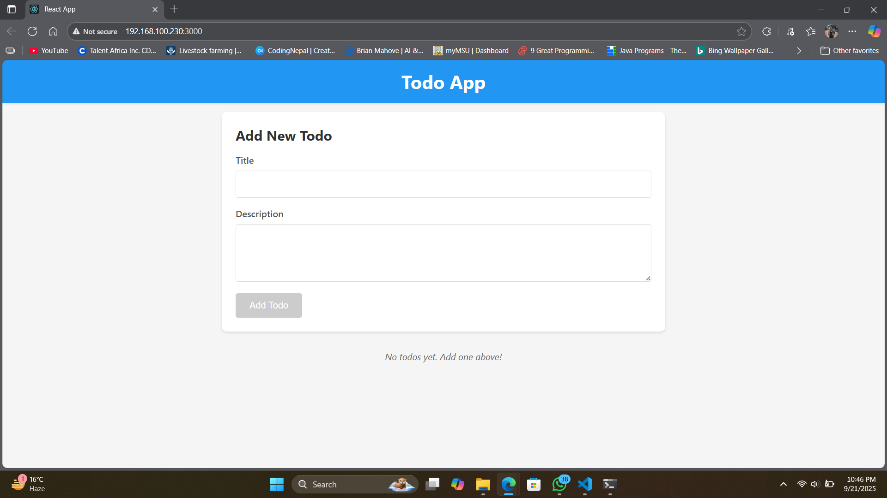
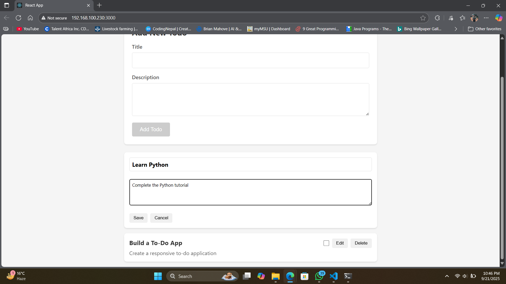
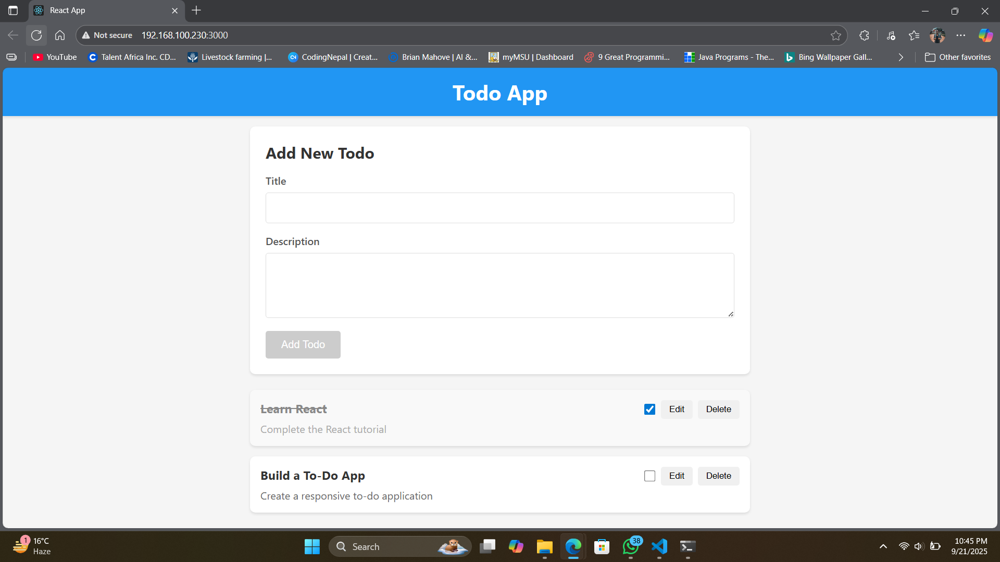
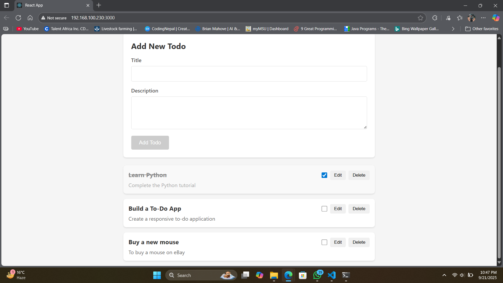
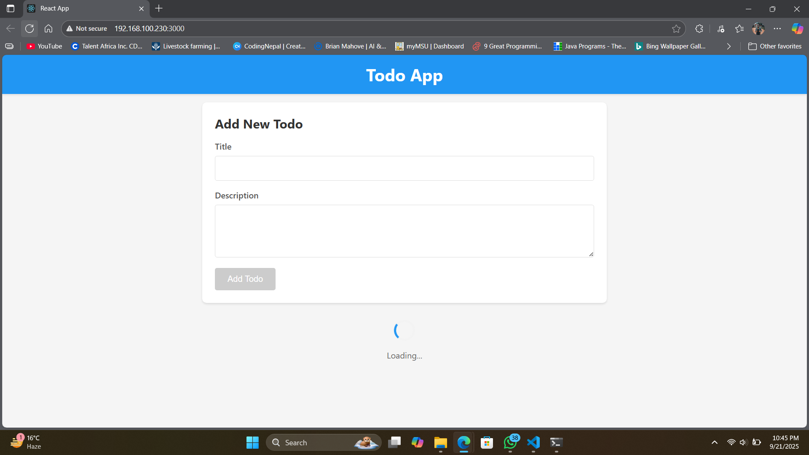
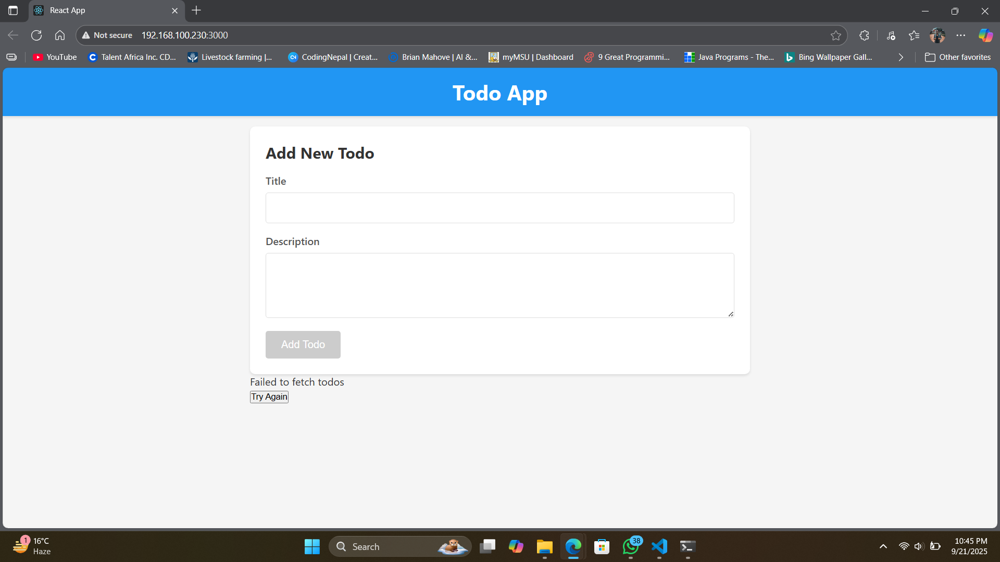

# Todo App

A simple **React + TypeScript** To-Do app with a local mock API.  
Manage your tasks by adding, editing, completing, or deleting todos with an interactive UI.

---

## Features

- Add new todos
- Edit todo title and description  
- Mark todos as completed  
- Delete todos  
- Loading spinner while data is fetching  
- Error messages with retry option  
- Fully responsive and interactive UI
  
---

## Tech Stack

- **React**  
- **TypeScript**  
- **CSS**  
- Local mock API for development

---

## Installation

1. **Clone the repository**

- https://github.com/brianmahove/todo-app-typescript.git
- cd todo-app

2. **Install dependencies**

- npm install

3. **Start the app**
   
- npm start

4. **Open in your browser**

- http://localhost:3000
---

## Screenshots

- Add New Todo

- Add Todo Form Empty

- Edit Todo

- Todo List

- Todo List 2

- Loading Spinner

- Error Message

